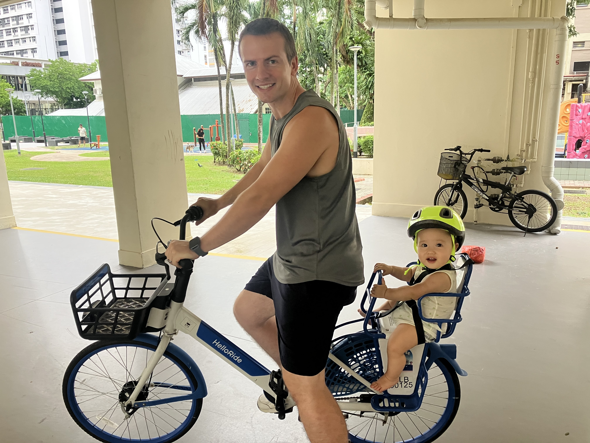

# Welcome to justin.albrethseng.com

My name is Justin Albrethsen and this is my personal site that I use to document and share my projects, publications, and a little about myself.

## About me
Right now I am living in Singapore with my wife Ruixin and our son Shane and we are getting ready to move back to my old home in Pittsburgh near the end of this year. While I generally enjoy working with my hands and building thing, living in a very dense city with high cost of land puts those interests out of reach for the moment. This has steered my interests towards more space constrained activities like building software or computers. 

For work I am doing research at Singapore University of Technology & Design. I worked there for nearly 5 years now on a few different projects. I started off building deep learning models to detect cyber attacks in power grids, then when that project finished I moved on to analyzing sensor data and forecasting residential power/water usage. After that I moved to building AI models to manage tactical networks and building the tools to let the AI models interact with the simulated networks. Finally my current project involves bringing software defined networks (SDN) to tactical networks for rapid network configuration of large scale military networks. 

One of the things that I most enjoy about research is the ability to move to new projects that sound interesting and then spend time learning about a new domain before applying what I have learned. I also get to have a diversity of roles within my role. I manage our server infrastructure, I write papers that get published, I build tools to run simulations, tools to process the simulation data, and AI models to learn from it all.

In a previous life I was a fresh mechanical engineering grad working in a paint factory. There I got to manage capital projects, design industrial automation systems, implement efficiency improvements, and troubleshoot some very interesting machinary. Here I learned my way around a PLC control cabinet (do NOT put your power cables in the same track as your sensor cables), and that almost every problem is due to dust on your sensors. 

Over the course of my futile pursuit to learn how everything works, I have completed a few personal projects here and there and have documented them on this site.

## Why albrethseng.com?
Those of you who are very sharp may notice that although my last name is Albrethsen, I use the domain albrethseng.com. This is because I originally used the domain to serve a registration page for my wedding. Since it is a wedding I thought it fitting that the domain include both mine and my wife's last names (hers is Ng) which fit in neatly at the end of mine, hence AlbrethseNg.
